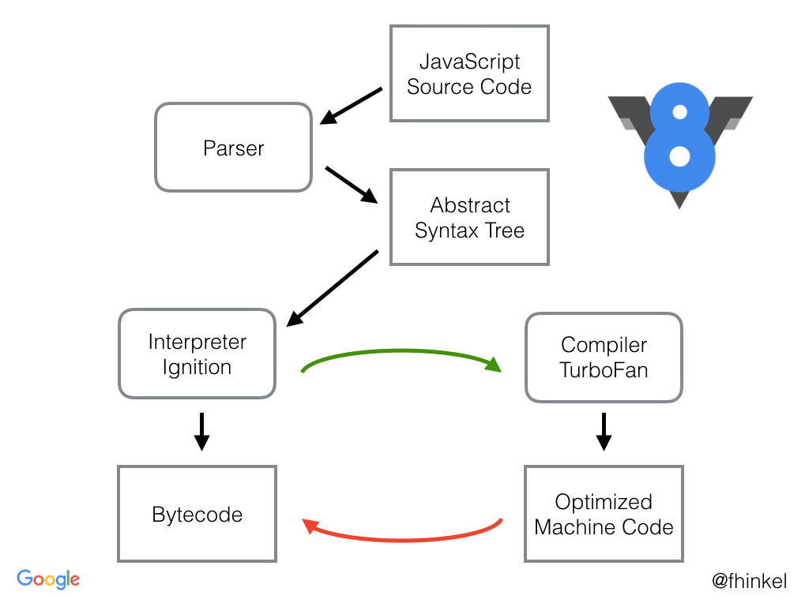

## Unraveling the Mysteries: How Chrome V8 Engine Actually Works

### Introduction

When you open your favorite website or run a web application in Google Chrome, you might not realize the immense power behind the scenes that enables a seamless and dynamic browsing experience. One of the unsung heroes responsible for this performance is the Chrome V8 engine. Developed by Google, V8 is an open-source JavaScript engine that executes JavaScript code with blazing speed and efficiency. In this blog post, we will dive into the inner workings of the Chrome V8 engine and understand how it achieves its magic.

 ### 1. What is a JavaScript Engine?

Before we delve into V8, let's grasp the concept of a JavaScript engine. A JavaScript engine is a piece of software responsible for interpreting and executing JavaScript code in a web browser or on a server. It takes the human-readable JavaScript code and converts it into machine code that the computer's processor can understand.

 ### 2. Overview of Chrome V8 Engine

The Chrome V8 engine is written in C++ and serves as the core of Google Chrome, Node.js, and many other applications. It is designed to be highly efficient and fast, making it an essential component of modern web applications. The engine consists of several major components that work together harmoniously to deliver impressive performance.

 ### 3. Ignition and TurboFan - V8's Compilation Pipeline



At a high level, V8 follows a multi-tier compilation pipeline. It initially uses a lightweight and fast interpreter called "Ignition" to quickly execute JavaScript code. This allows V8 to start executing code almost instantly.

During the interpretation phase, V8 observes which parts of the code are executed more frequently, known as "hot" code. These hot parts are then passed through to the "TurboFan" component, where they undergo more intensive optimization and are compiled into highly optimized machine code.

By employing this adaptive compilation strategy, V8 achieves a delicate balance between starting execution quickly and delivering optimal performance for frequently executed code paths.

 ### 4. Hidden Classes and Inline Caching

One of V8's key optimizations is the use of hidden classes and inline caching. JavaScript is a dynamic language, that allows objects to change their structure during runtime. To optimize property accesses on objects, V8 uses hidden classes, which are essentially internal maps that store the relationships between an object's properties and their offsets.

Inline caching is a technique used by V8 to optimize property access. When a property is accessed on an object for the first time, V8 uses the hidden class to identify the property's offset. For subsequent accesses to the same property on the same object, V8 directly uses the previously determined offset, avoiding unnecessary lookups and boosting performance.

#### Hidden Classes:
In JavaScript, objects are dynamic, meaning their structure can change during runtime. As properties are added or removed from an object, its internal layout can change, leading to potential performance bottlenecks during property access.

To overcome this challenge, V8 employs a technique called hidden classes. When an object is created and properties are added to it, V8 assigns a unique hidden class to represent the object's internal structure. This hidden class acts as an internal map that links property names to their respective offsets within the object.

For example:

```js
class Point {
  constructor(x, y) {
    this.x = x;
    this.y = y;
  }
}
const point1 = new Point(1, 2);
const point2 = new Point(3, 4);
```

In this code, both `point1` and `point2` objects are instances of the Point class. Although both objects have the same properties, `x` and `y`, V8 assigns them, different hidden classes, internally, as they are created independently.

#### Inline Caching

When JavaScript code is executed, V8's interpreter (Ignition) handles property accesses. During this interpretation phase, V8 tracks which hidden class each object has and how properties are accessed.

When a property is accessed for the first time on an object, V8 looks up the hidden class associated with that object to determine the offset of the requested property. However, the real magic happens during subsequent property accesses.

As property accesses are repeatedly performed on the same object with the same property name, V8 uses a technique called inline caching. It observes the pattern and behavior of property accesses for a specific object and caches the offset information directly at the call site of the property access in the generated machine code.

For example:

```js
const point1 = new Point(1, 2);

// First property access
console.log(point1.x); // V8 performs a hidden class lookup to find the offset of 'x'

// Second property access
console.log(point1.x); // This time, V8 uses inline caching and directly retrieves the offset of 'x'

```

By caching the property offset at the call site, V8 eliminates the need for repeated hidden class lookups, significantly improving property access performance for frequently accessed properties.

It is important to note that if the object's structure changes (i.e., new properties are added or existing properties are removed), V8 invalidates the cached offsets for that specific call site, and the process of hidden class lookup and inline caching is repeated.

 ### 5. Garbage Collection

Memory management is crucial in any programming language, and JavaScript is no exception. V8 employs a garbage collector that automatically reclaims memory that is no longer in use, preventing memory leaks and ensuring efficient memory usage.

The garbage collector in V8 is designed to minimize pauses and interruptions during application execution. It uses generational garbage collection, which divides objects into different generations based on their age. Younger objects are collected more frequently, while older objects are collected less often, reducing overall garbage collection time.

### Conclusion

The Chrome V8 engine is a masterpiece of engineering, meticulously crafted to deliver a superior browsing experience by executing JavaScript code with incredible speed and efficiency. Through a clever combination of interpretation and adaptive compilation, hidden classes, inline caching, and advanced garbage collection techniques, V8 has become a powerhouse that empowers modern web applications and beyond.

Next time you open your browser or interact with a web application, take a moment to appreciate the immense work that goes on behind the scenes, making the web a dynamic and interactive place. Chrome V8 continues to evolve, constantly pushing the boundaries of what's possible and laying the groundwork for the future of web development.
